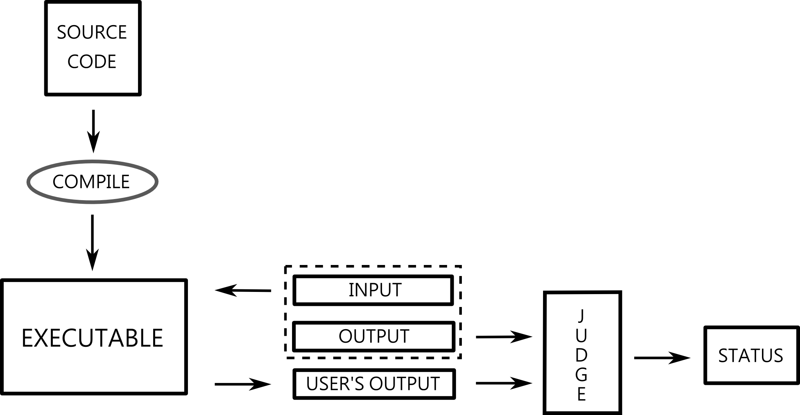

############
Introduction
############

To sketch the idea of automatic program correctness verification as simple as possible we 
first consider classical (manual) methods and after that we present automatic methods. 
We are going to point differences between these two approaches and indicate advantages of 
the automatic method.

Manual verification
-------------------

The problem setter needs to try the code manually i.e. he needs to try it for some simple 
input data. In that situation even simple programs require at least small human readable 
interface. Let us consider the following toy example along with the *C* language solution:

Integer power

Write the program which takes two numbers *a* and *b* and returns the value of *ab*.

.. code-block:: cpp

   int atob(int a, int b)
   {
     int i, result = 1;
     for(i=0; i < b; i++)
     {
       result *= a;
     }
     return result;
   }
   
   int main()
   {
     int a,b;
     printf("Give a: ");
     scanf("%d", &a);
     printf("Give b: ");
     scanf("%d", &b);
     printf("a to the power of b = %d", atob(a,b));
     return 0;
   }

After compiling and running that piece of code the problem setter is ready to use the program. 
Nevertheless, it is easily seen that manual verification requires autor's continuous preparation - 
for each input the autor must know the correct output. That's the rule for all problems he manages - 
the author is forced to remember how to verify the corectness of all his problems. Another issue is 
that he probably wants to be reliable thus he needs to handle with all boundary, clever and problematic 
input instances. Some interesting situations can be pointed even for that simple problem above. 
For example, does *a* to the power of *zero* give *1*?

Another question is how to deal with time and memory complexity issues? Academic experience of 
members of our team yields that the automatic judge solutions save plenty of time and greatly 
improve the quality of verification.

Automatic verification
----------------------

Moving on to the online judging we will present you how we need to change approach. 
Now whole the process of the compiling, running and testing is going to be conducted 
by the machine thus we need to clearly specify how the program should communicate - 
that part we call *input / output specification*. Suppose we want to prepare 
the *Integer power* problem to automatic judging and suppose the presented source code 
fulfills desired input/output specification (usually the direction is opposite - first 
we specify the input and output structure then we implement the solution). It means we 
need, along with the problem definition, give the information that program should expect 
two integer numbers on the input and needs to print the information "Print a: Print b: 
a to the power of b = ab". Clearly the output specification is highly unnatural.

As you can see we don't need to have any human readable interface at all. In fact, it is 
rather obstruction which can even lead to reject correct solutions due to some complicated 
or nonintuitive input or output requirements. How simple can the previous *Integer power* 
problem could be if we drop all the input / output formating? We don't want to have any 
"Give me the value" statements to obtain the input and "Result is" statements in the output 
thus it would be enough to stay with minimal source code:
        
.. code-block:: cpp

   int atob(int a, int b)
   {
     int i, result = 1;
     for(i=0; i < b; i++)
     {
       result *= a;
     }
     return result;
   }
   
   int main()
   {
     int a,b;
     scanf("%d %d", &a, &b);
     printf("%d", atob(a,b));
     return 0;
   }

We highly recommend you to put emphasis on input / output specification when you will present 
your instance of the service to your own users. Base on our own experience with online judge beginners 
users we know that it's most dangerous when you deal with developers who have some basic knowledge 
already and along with that probably some habits. We present extended description of input and 
output specification in the next section.

Finally, let us take a look at the simplified submission flow diagram:
        

In this diagram we can see how user's source code go through the system. Firstly it is compiled by a 
proper compiler (according to the selected programming language) which produces executable file1. 
In the next step created executable is fed with model input data and we obtain the user's output file. 
The final step is the procedure of comparing the user's output file with the model output file, we call 
it *judging*. The judge returns the status of the submission. Note that the diagram is a simplified sketch 
of the idea and we will extend both the picture and the explanation.

1. In case of script languages we use proper interpreter to run the code.
