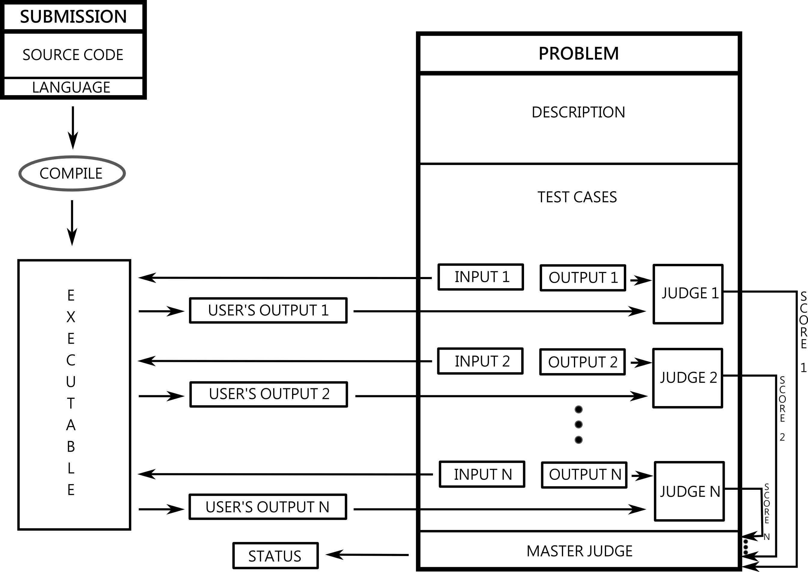

Problems
========

In this section we are going to give you insight into submission flow and online judge problem 
construction. From the previous section we know basics of the concept of the online judging. 

To better understand and make it possible to create own problems we will describe components of 
the problem:

 - **Description**
 
   - The task
   - Input / output specification
   - Input / output examples
   
 - **Test case(s)** (possibly many)
 
   - Input file, 
   - Output file
   - Time limit
   - Judge
   
 - **Master judge**

Before we begin the analysys of the individual components let us take a look at the complete 
diagram of submission flow to embed the listed components in overall view.

The diagram is the extension of the one from the previous section. The main difference is the 
appearance of the *master judge* component. Since we have introduced possibility of many test 
cases (input, output and judge) thus we need the summary component to combine the results from 
test case judges - we call that summary component *master judge*. 

The other new elements of the 
diagram was mentally present before but we purposely omited them to keep the previous view as 
simple as possible. 

Now we can explain that every submission needs to have precised 
*programming language* to choose proper compiler or interpreter. The problem description is the 
crucial part for users to make it possible to solve the problem.

Now let us recall the *Integer Power* problem since we are going to use it as a demonstration 
example. The task described in the problem is to compute the value of *ab* for given 
integers *a* and *b*

Description
~~~~~~~~~~~

User must be able to understand the problem to solve it successfully. Description contains 
complete information needed to solve the problem thus it is the most important feature from 
the user's point of view.

**The task**
The formal text that describes the specificity of the problem usually in mathematical manner. 
To achieve good quality of the description it is a good habit to graphically illustrate the 
problem. It is also desirable to support a dry theory with simple examples.

.. note::
   According to the *Integer Power* problem we could write the taks as follows:
   
   Write the program which takes two numbers *a* and *b* and returns the value of *ab*. 
   For example for *a = 3* and *b = 4* the result is *3^4 = 81*
   

**Input / output specification**

The previous part was formal from the mathematical perspective but not syntactically. Automatic 
judging is only possible when we can make an assumption on the problems's input and output behaviour. 
The interior of the user's program is a black box for us right now. We specify what is the input file 
structure to make it possible for users to implement proper input reading. The specification of input 
file should be an information that user can rely on.

On the other hand we expect that user produces output file with a predictable structure. Formal 
specification of the output file is an information that we are going to rely on to verify the correctness 
of the submission.

Referring to the *Integer Power* problem let us recall <a href="#judge-source-code">possible solution</a> 
of the problem. We didn't specify any formal input or output syntax in the previous section. First attempt 
was the solution with the human readable interface and after that we modified the code to achieve a raw 
version. We can use that source code as a base for following formal specification:

.. note::
   **Input** 
      In the only line of the input there will be two integer numbers *1 <= a <= 8* and *0 <= b <= 10* 
      separated by a single space character.

   
   **Output**
      Program should write a single number which is a value of *ab*.

**Input / output examples**
In the task subsection we mentioned that it is a good habit to ilustrate the problem with the examples. 
The examples here are dedicated to ilustrate the input and output files structure. In the best case scenario 
they cover every distinct configuration of parameters (up to numbers, letters etc.) which is important for 
more complex problems.

Referring to the *Integer Power* problem we present how we could compose the examples:

.. note::
   **Example 1:**
   
   **Input:**
   3 4
   
   **Output:**
   81
            
   **Example 2:**
   
   **Input:**
   7 0
   
   **Output:**
   1
      
Test case(s)
~~~~~~~~~~~~

Just as the description was for users only so the test cases are for the machine checker. 
This is the essence of the automatic judging idea. The vast majority of the usages implements 
the following schema: there is a model input paired to a model output along with the program 
which can compare that model output with the user's output to decide whether user's answer is 
good or not.
 
**Input and output files**
Input file contains the problem instance and it must be consistent with the input specification. 
The output file should contain corresponding correct answers formatted in accordance to the 
output specification.

of the correct program should be contained in the output file. It is not necessery to write the 
solution to the program to create the output file - it can be obtained in any manner.

According to the *Integer Power* problem we present how we could prepare following test cases:

.. note::
   **Test case 1:**
   **Input file:**
   3 4
   **Output file:**
   81

   **Test case 2:**
   **Input file:**
   7 0
   **Output file:**
   1

**Remark.** It is recomended to construct the problems that are able to repeat the desired procedure 
as many times as we want to make it possible to test the user's submission with one test case. 
There are many reasons for that approach and for further information please visit 
<a href="#good-test-cases-design">good test cases design</a> appendix.

**Time limit**
We have already pointed that one of the features of online judging is the possiblity of estimating 
the time complexity. To achieve that the author of the problem has to adjust the timeout for program 
execution. Consider the case when the author knows two different algorithms for a problem, say *A* and *B*. 
Let us assume that the algorithm *A* is noticeably faster than the algorithm *B*. It is not very 
easy and obvious how to preper test cases to distinguish between these two algorithms. However, 
assuming that we have input data which is processed in the time *tA* for the algorithm *A* 
which is much faster than execution time *tB* for the algorithm *B* we can simply set the 
time limit somewhere between those values.

With the timeout *tA <= t0 <= tB* we can assume that *A*-like algorithms 
will pass the test case and *B*-like algorithms will fail it due to exceeding the time limit.
        
**Remark.** Note that the presented approach highly depends on the machine thus you need to adjust your 
time limit to the computing cluster rather then your local machine.

Our toy example problem is much too simple in assumptions to allow us to present example of time limits 
that distinguish different algorithms thus we put default time limit of *1s*. In the next section we present 
more complex example where we further discuss the time limit which can help to estimate the algorithm quality.

**Judge**
The judge is a program which process user's output file after execution. Its task is to establish if the 
submission passed the test case and potentially also returns *the score*. When the user's program pass the 
test case the returned status is *"accepted"*.

Usually the judge implementation is reduced to compare the model output file with the user's output file. 
We support problem setters with default judges:
- **Strict** - it requires output files to be identical 
- **Ignoring differences in whitespaces** - similar to the previous one but it ignores all extra whitespaces
- ""Ignoring floating point errors up to a specific position** - it allows the floating point numbers to be 
  inaccurate i.e. we can accept the errors up to for example *0.001*

**Remark.** The *Ignoring differences in whitespaces* judge is one of the most popular default choice. It is 
more liberal for output formating errors which in fact doesn't affect on the solution semantic correctness. 
Similarly *Ignoring floating point errors up to a specific position* judge is popular choice for problems 
where result numbers are not integers.

We have mentioned that the judge can also return *the score*. More information will be presented in the section 
<a href="#advanced-judges">advanced test case judges</a>, for now you can assume that the score is the test 
case execution time.

It is possible to create custom test case judges. The author can implement any kind of verification having full 
access to the input file, base input file, user's output file and even user's source code. For more information 
visit the section <a href="#advanced-judges">advanced test case judges</a>.

For the *Integer Power* problem we decide to use default *Ignoring differences in whitespaces* judge for each 
test case thus we allow the user to generate extra whitespaces before and after the resulting number *ab*. 
For example when user's solution prints *"&nbsp;&nbsp;&nbsp;81&nbsp;&nbsp;&nbsp;&nbsp;"* as a result for *"3 4"* 
problem instance it is still correct answer.

Master judge
~~~~~~~~~~~~

We have discussed the individual test cases for the problem and established that each of them returns information, 
i.e. status and the score. The master judge is the component which combines all incoming results obtained from test 
cases to produce the final result which is the status and the score. You can look again at the 
<a href="#submission-flow-diagram">submission flow diagram</a> for better understanding.

There are predefined master judges proper for most situations:
- **Generic masterjudge** - it gathers information from test case judges and requires each of them to achieve *"accepted"* 
  as the result to establish final result as the *"accepted"*. When any test case ends with error the final answer is 
  inherited from the first failed test case. For example when the problem has five test cases and the second and the 
  fourth ones failed, the final result is inherited from the second test case. Generic masterjudge combines the execution 
  times of all testcases and yields the sum as the final score.
- **Score is % of correctly solved sets** - it is a more liberal masterjudge which allows to accept incomplete solution 
  with the score which is the percentage of correctly solved test cases. For example when the problem has five test cases 
  and again the second and the fourth ones failed but the rest was passed, the final score is equal to *60%*. The advantage 
  is that the user gets more information about the correctness level of its solution.

When you need to use more complex master judge it is possible to create the new one or modify the existing ones. You have 
access to the source code of default master judges and they can be used as a base for your modifications. Further information 
about designing master judges you can find in the section <a href="advanced-master-judges">Advanced master judges</a>

The last missing part for the example we successively improve is the choice of master judge. We created two test cases and 
there is no need to implement the specific own master judge thus we select default one. When we need to distinguish the 
solutions as better or worst (but both correct) we should rather choose *Score is % of correctly solved sets* but in our 
situation each test case is a pure verification of correctness (i.e. no performance aspects tested) thus we select 
*Generic masterjudge* to force the user's solution to pass all test cases.

      
Complete example
~~~~~~~~~~~~~~~~

We have discussed all components of the problem specification therefore we are able to present whole problem setting:

**Title**
  The Integer Power
   
**Description**
  Write the program which takes two numbers *a* and *b* and returns the value of *ab*. For example 
  for *a = 3* and *b = 4* the result is *34 = 81*
   
  *Input / output specification:*
  
  **Input:** In the only line of the input there will be two integer numbers *1 <= a <= 8* and *0 <= b <= 10* 
  separated by a single space character.
  **Output:** Program should write a single number which is a value of *ab*.</strong>

  *Examples:*
              
  Example 1:
  **Input:**
  3 4

  **Output:**
  81
  
  
  Example 2:
  **Input:**
  7 0

  **Output:**
  1

**Test cases**

  **Test case 1:**
  
  **Input file:**
  3 4
  **Output file:**
  81
  **Judge** - Ignoring differences in whitespaces
  **Time limit** - 1s
  
  **Test case 2:**
  **Input file:**
  7 0

  **Output file:**
  1
  **Judge** - Ignoring differences in whitespaces
  **Time limit** - 1s

**Master judge**
  Generic master judge
